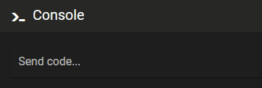

# Console Shortcuts

### Help command

Issue a `HELP` command to get a list of possible commands.

### Autocomplete

You can start typing a command and then complete it with the tab-key. If there are several possibilities, you will get a list of choices.

### Scroll through commands

Using the 🔼 up / 🔽 down  arrow keys you can scroll previous commands.

