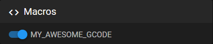

# Hide macros, outputs or fans

Did you know, that you can also hide gcode macros by prefixing the name with an underscore?

```text
[gcode_macro MY_AWESOME_GCODE]
gcode:
	_MY_HELPER_CODE
```

```text
[gcode_macro _MY_HELPER_CODE]
gcode:
	M300
```

`MY_AWESOME_GCODE` appears in your interface settings, `_MY_HELPER_CODE` not.




By the way, this also works for other configuration sections like, **fans and outputs.**


